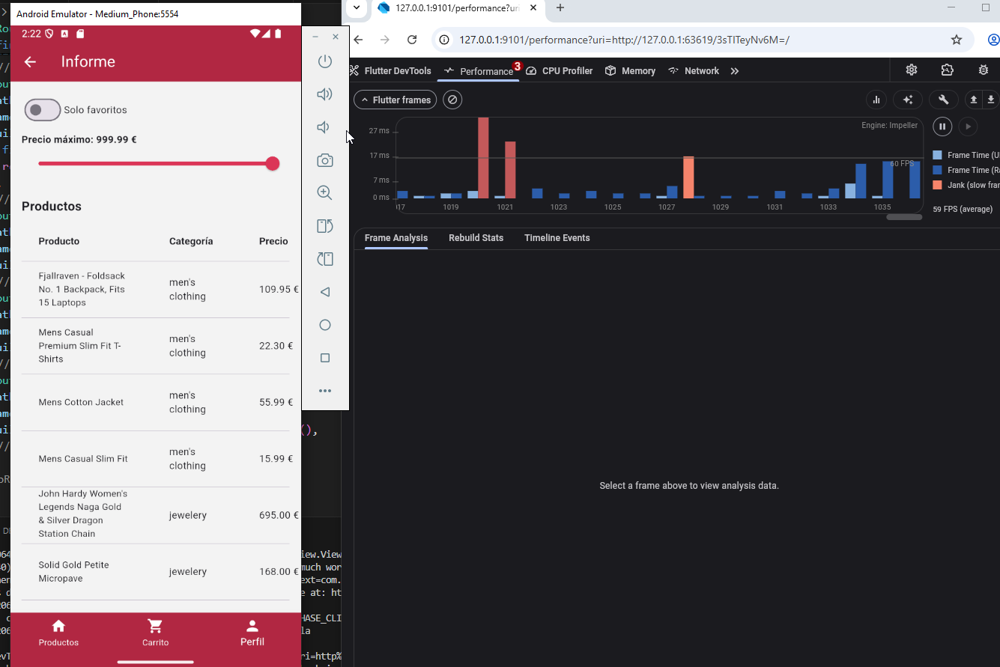
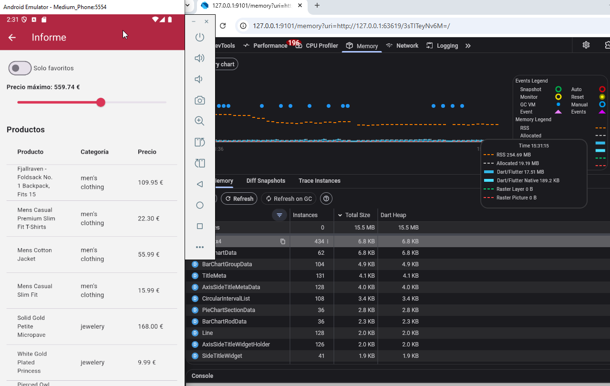
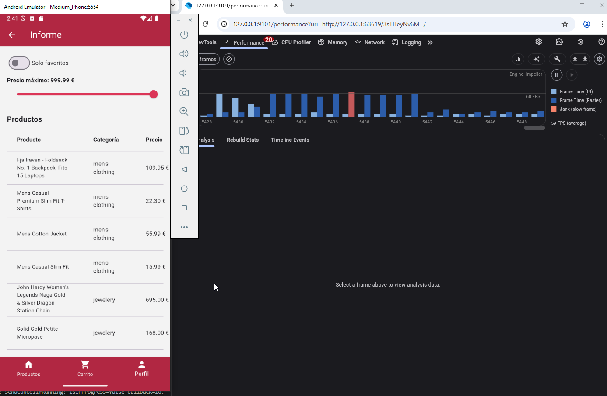
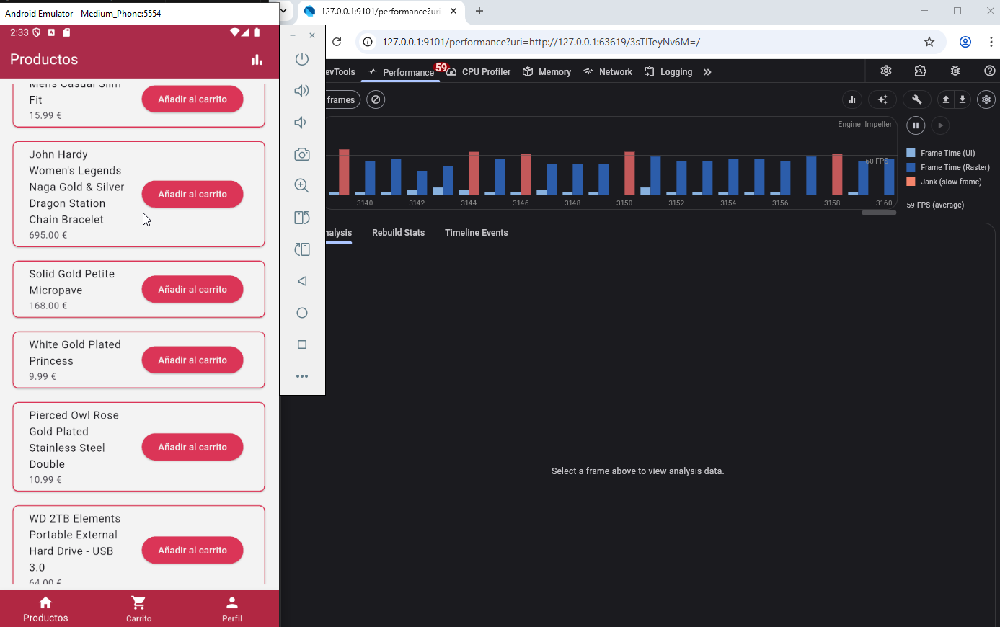
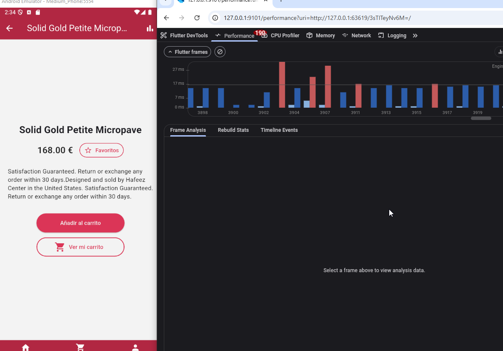

# Resultados de Pruebas Avanzadas

Este documento recoge los resultados de los tests realizados con la app UD7 (API + Firebase + informe).

Los tests se enfocan en 3 aspectos pricipales:
- Seguridad de peticiones HTTP y API
- Detección de jank y tiempos de respuesta elevados en la pantalla de informe
- Medición de CPU y jank al realizar navegación rápida y repetitiva en las pantallas principales (home, carrito y detalle)

## Seguridad de peticiones

La verificación de que las peticiones y los intercambios con la API son seguros (usan HTTPS)
se realiza mediante un el test automatizado seguridad_test.dart principalmente, que verifica
que la URL base usa protocolo HTTPS.

## Analisis de rendimiento de la pantalla de informe
Usando DevTools se ha analizado el nivel de jank y uso de memoria correspondiente a la pantalla
de informe. Se ha realizado un uso estándar de la pantalla de informe (carga, y ajuste de los filtros), y se han tomado las siguientes mediciones:

Al cargar la pantalla de informe:

Uso de memoria afectado por el slider y botoón de favoritos de la pantalla de informe:

Rendimiento al ajustar el slider de favoritos:

## Prueba de estrés
Las pruebas de estrés se realizaron repitiendo numerosas veces el mismo proceso de carga, scrolleo y navegación a vista detalle y de vuelta, tomando mediciones del rendimiento. El rendimiento promedio es el siguiente (no hubo crash de la aplicación):

En ocasiones se pueden apreciar picos como el siguiente:

## Conclusiones Generales
La app es relativamente estable en lo que se refiere a rendimiento, tiene algunos picos de tiempo de respuesta pero en condiciones normales no debería crashear.

## Mejoras Propuestas principales

**Optimización de renderizado de listas**: implementar paginación o mecanismos similares para reducir la carga inicial y el uso de memoria en listas muy grandes, ya que se carga todo el contenido de la API a la página principal, y dependiendo de la extensión de este, puede tener impacto significativo en el rendimiento.  

**Cacheo de datos de API**: almacenar localmente resultados de productos y favoritos para disminuir tiempo de carga y tráfico de red. Relevante tambien en relación con el punto anterior, ya que no resulta eficiente realizar una llamada a la API para renderizar los mismos datos cada vez, sobre todo si los datos son extensos.
