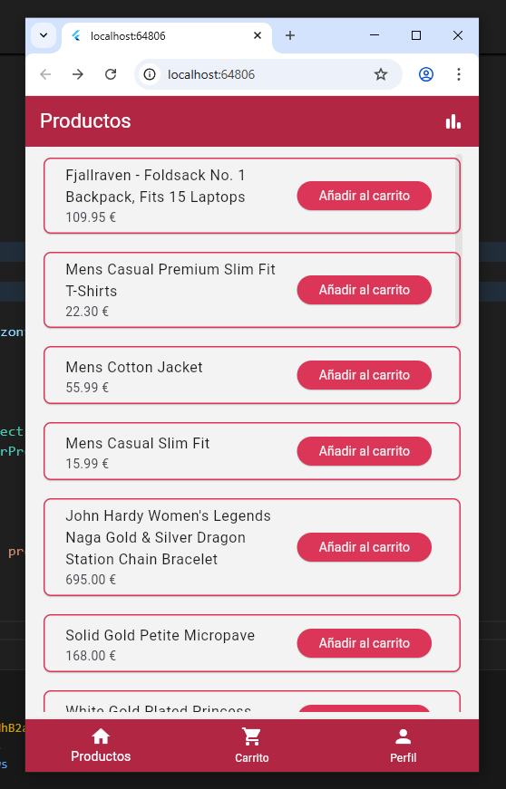
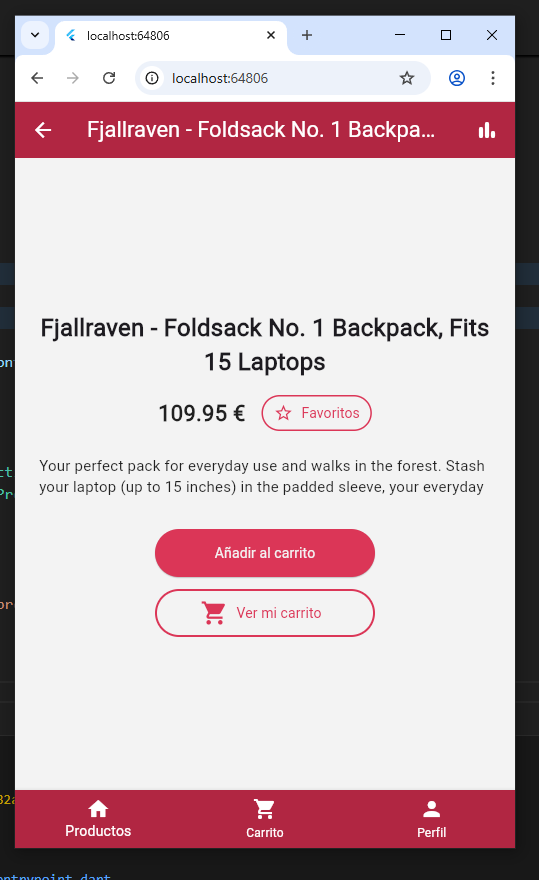
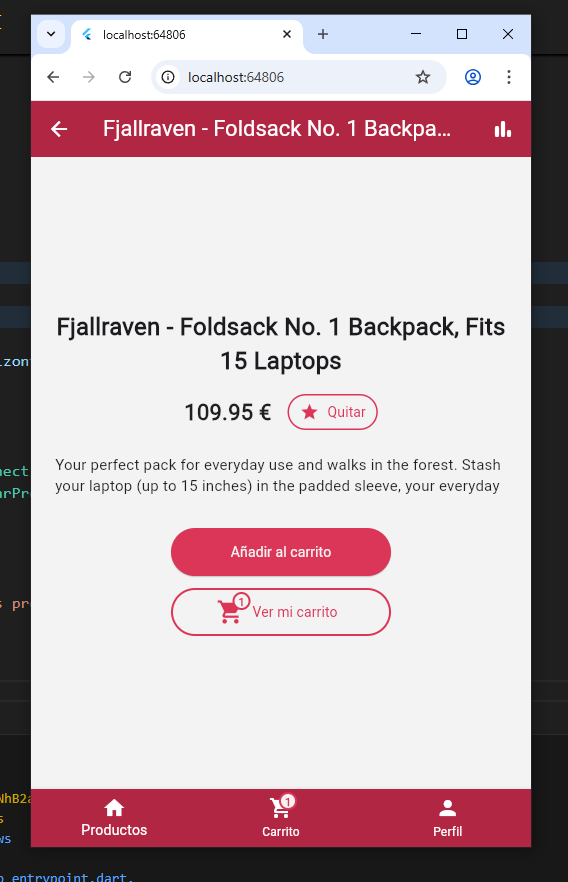
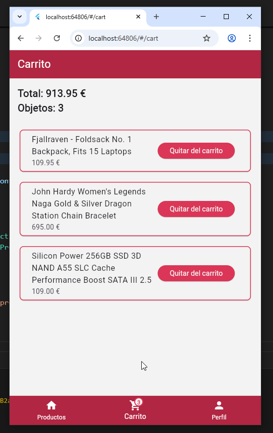
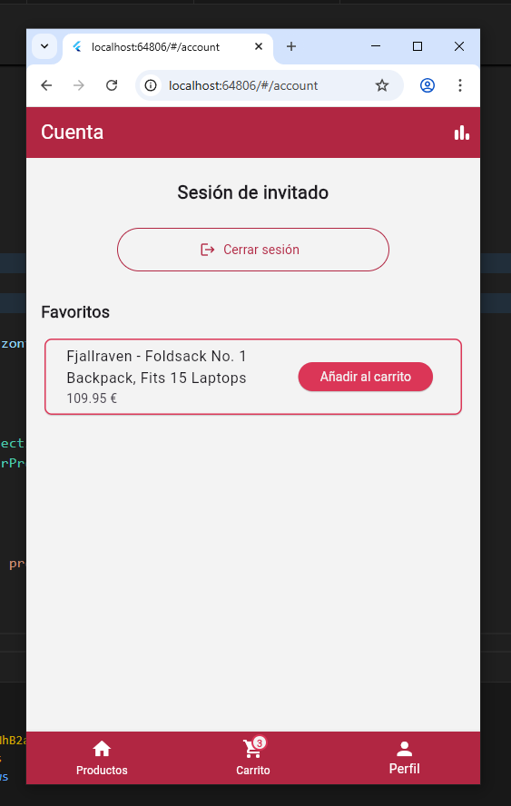
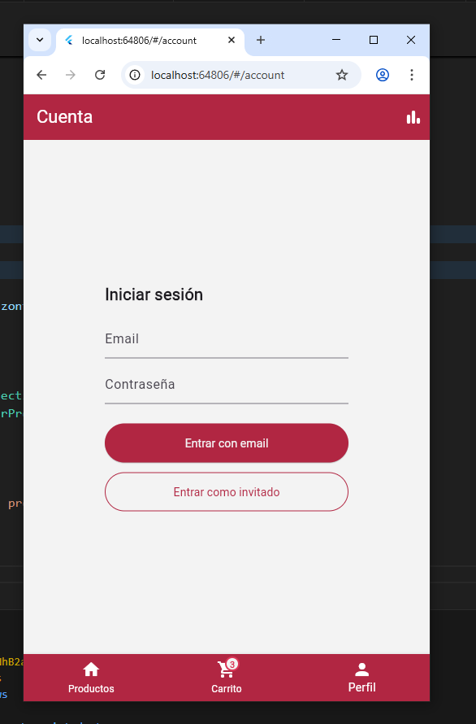
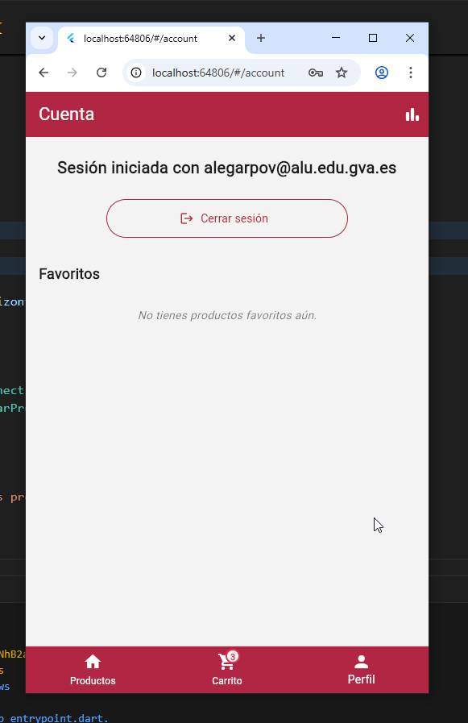
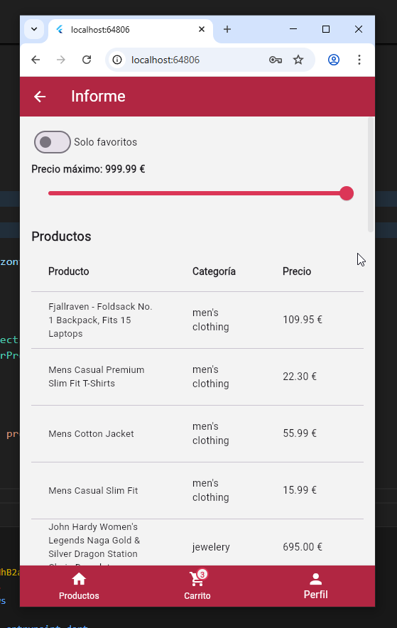
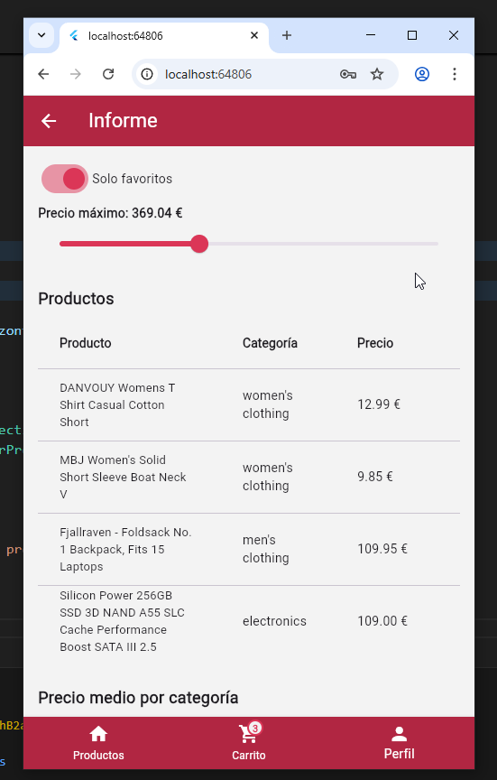
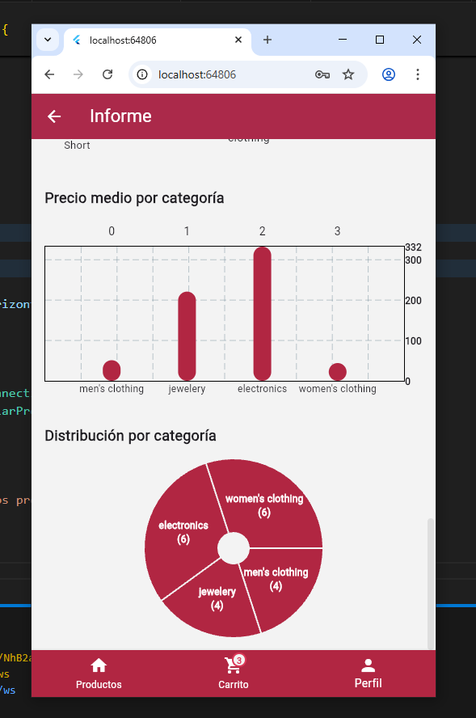

# Tutorial rápido (10-15 min)
En este tutorial se muestran capturas de pantallas de la versión web + pantalla estrecha, en la carpeta img hay directorios con capturas similares para la versión de android, y la versión web de pantalla ancha.

1) Clona/descomprime el proyecto.
2) Instala dependencias: "flutter pub get".
3) Sigue las instrucciones de configuración disponibles en instalación_configuración.md para configurar Firebase.
4) Arranca: "flutter run -d chrome" (o emulador).
5) Home:
   - Se mostrará la lista de productos cargados de la API
   - Pulsa “Añadir al carrito” para añadir un producto al carro.
   - Tap en la tarjeta para abrir la vista de detalle del producto.
   
6) Detalle:
    - En la vista de detalle se muestra información más detallada del producto.
    - También aparecerá la opción de añadir un producto a favoritos.
    - Añade el producto a favoritos y al carrito.
    - Se actualizará el icono del carrito para reflejar al aumento de productos en el carrito.
    
    
    - Pulsa el botón de "Ver mi carrito" o el navigationrail / bottombar para acceder al carrito a continuación.
7) Carrito:
    - En el carrito se muestran los objetos añadidos, el recuento y el total de precio
    
    - A continuación, pulsa el botón con el icono de una persona y la etiqueta "Perfil" en el navigationrail o bottombar.
8) Iniciar sesión
    - Si has añadido un producto a favoritos, automáticamente se te habra iniciado una sesión anónima (sesión de invitado) y verás la siguiente pantalla:
    
    - En caso contrario, verás las opciones de inicio de sesión:
    
    - Si hay una sesión activa, en esta vista se muestra qué persona tiene la sesión iniciada y los productos que haya marcado como favoritos.
    
    - A continuación, pulsa el botón de la esquina superior derecha para acceder a la vista de informe.
9) Informe
    - En esta pestaña se muestra información sobre los productos cargados.
    
    - Esta información puede filtrarse para mostrar solo los productos marcados como favoritos, o según precio máximo de producto.
    
    - Si bajas a la parte inferior de esta vista, se muestran gráficos con información sobre el precio medio de cada producto según su categoría, y el recuento de productos en cada categoría.
    A estos gráficos se les aplican los filtros de favoritos/no favoritos y precio máximo.
    
    
10) Con esto concluye el flujo de uso de la aplicación. El siguiente paso es el cierre de sesión y desinstalación según la plataforma.